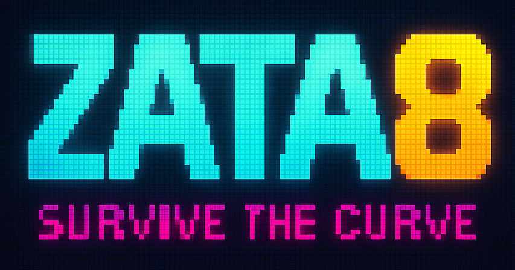

# 🌀 Zata8

<p>
  <a href="https://github.com/thespielplatz/zata8/">
    
  </a>
  <a href="https://github.com/thespielplatz/zata8/blob/main/LICENSE">
    
  </a>
  <a href="https://github.com/thespielplatz/nuxt-auth/stargazers">
    
  </a>
</p>

**Zata8** is a modern 8-player remake of the classic DOS game *Zatacka*. Built for party-style, local multiplayer chaos, players compete on one screen using custom two-button controllers. Dodge, turn, and outlast your friends — or crash in style.



---

## 🎮 Features

_nothing done yet_

---

## 🛣️ Roadmap

- 8-player local multiplayer game
  - Curve-based survival gameplay
  - Tight arcade-style turning mechanics
- USB controller support (custom ESP32 HID device)
- 3D-printable controller housing and button panel
- Zata8: Snake trailing on the menu screen
- Zata8: Default winning points `(numOfPlayers - 1) * 10` and make it configureable

---

## 🗂 Project Structure

```text
├── game/ # Godot 2D game
├── controller/ # ESP32 firmware (USB HID)
├── hardware/ # 3D models, wiring diagrams
├── docs/ # Gameplay rules, design notes
├── design/ # Logo, UI mockups
```

## 📄 License

This project is licensed under the [MIT License](LICENSE).  

---

## 🙌 Credits

- Concept and development by [thespielplatz](https://github.com/thespielplatz)
- Inspired by the original *Zatacka* game
- Built with [Godot Engine](https://godotengine.org/)

---

## 🧠 Contributions

PRs, feedback, bug reports, and gameplay ideas are welcome!

## Support

If you like this project, give it a star! If you love it, fork it and take it out for dinner. 🌟🍽️ And hey, why not [send some tip love?](https://thespielplatz.com/tip-jar)
